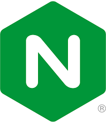

# Deliverable 1 Submission

## Basic Terminology

### What is a web server?

>A **web server** is a software application or hardware device that processes and delivers web content to users over the internet. It handles requests from clients (web browsers) and responds by serving the requested web pages, files, or other resources.

### What is Apache?

>**Apache** refers to the **Apache HTTP Server**, an open-source web server software widely used to serve websites on the internet. It processes and delivers web content to users' browsers and supports various features, including customizable configurations and modules.

### What are some example web server applications?
|Application Name|	License	| Project's Website|
|----------------|----------|------------------|
|Nginx	|BSD 2-Clause License |	nginx.org|
|Microsoft IIS|	Proprietary |	microsoft.com|
|LiteSpeed	|Proprietary |	litespeedtech.com|

### Nginx

>**Nginx** is a powerful and efficient open-source web server known for its high performance and scalability. It is widely used to serve static content, reverse proxy, and load balance across multiple servers.

### Microsoft IIS

>**Microsoft Internet Information Services (IIS)** is a web server developed by Microsoft for Windows Server. It provides a robust platform for hosting and managing web applications and services on Windows environments.

### LiteSpeed

>**LiteSpeed** is a high-performance, secure, and scalable web server known for its efficiency. It is designed to improve website performance and can be used as a drop-in replacement for Apache.

### What is virtualization?

>**Virtualization** is a technology that allows the creation and operation of multiple virtual instances or environments on a single physical hardware system. It enables the efficient utilization of resources, isolation of applications, and improved flexibility in managing and deploying IT infrastructure.

### What is VirtualBox?

>**VirtualBox** is a free and open-source virtualization software that allows users to run multiple operating systems on a single physical machine. It provides a platform for creating and managing virtual machines, facilitating the testing and deployment of different operating systems on the same hardware.

### What is a virtual machine?

>A **virtual machine** is a software emulation of a physical computer, running an operating system and applications as if it were a separate physical machine. Virtual machines operate within a virtualization environment and are often used for testing, development, and running multiple operating systems on a single physical host.

### What is Ubuntu Server?

>**Ubuntu Server** is a variant of the Ubuntu operating system designed specifically for server environments. It provides a stable and secure platform for hosting websites, applications, and services. Ubuntu Server is based on Debian and follows a regular release cycle with Long-Term Support (LTS) versions for extended stability.

### What is a firewall?

>A **firewall** is a network security device or software that monitors and controls incoming and outgoing network traffic based on predetermined security rules. It acts as a barrier between a trusted internal network and untrusted external networks, allowing or blocking data packets based on defined security policies.

### What is SSH?

>**SSH, or Secure Shell**, is a cryptographic network protocol used to securely access and manage network devices and servers over a potentially unsecured network. It provides encrypted communication between a client and a server, allowing users to log in remotely, execute commands, and transfer files securely.

### Other Relevant Concepts

#### Systemd

>**Systemd** is a system and service manager for Linux operating systems. It initializes and manages system processes, daemons, and services during the boot process, improving system startup times and resource management.

#### Systemctl

>**Systemctl** is a command-line utility used to control and query the state of the systemd system and service manager. It allows users to manage services, examine system logs, and perform various system-related tasks.

#### Virtual Hosts

>**Virtual hosts** refer to the practice of hosting multiple websites or domains on a single web server. Each virtual host has its own set of configurations, allowing a single server to serve multiple websites.

#### Log File

>A **log file** is a record of events or activities generated by a software application, system, or service. It captures information such as errors, warnings, and other relevant data, providing a useful resource for troubleshooting and system analysis.