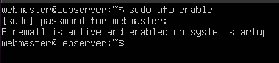
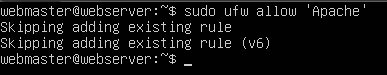

# Deliverable 2 Submission

## What are the server hardware specifications (virtual machine settings)? Take a screenshot - don’t type it!

## What is Ubuntu server log in screen? Take screenshot - do not type it!

## What is the IP address of your Ubuntu Server Virtual Machine?

> http://192.168.1.180/

## How do you enable the Ubuntu Firewall?

> sudo ufw enable

## How do you check if the Ubuntu Firewall is running?

> sudo ufw status

## How do you disable the Ubuntu Firewall?

> sudo ufw disable

## How do you add Apache to the Firewall?

> sudo ufw allow 'Apache'

## What is the command you used to install Apache?

> sudo apt install apache2

## What is the command you use to check if Apache is running?

> systemctl status apache2 --no-pager

## What is the command you use to stop Apache?

> sudo systemctl stop apache2

## What is the command you use to restart Apache?

> sudo systemctl restart apache2

## What is the command used to test Apache configuration?

> sudo apache2ctl configtest

## What is the command used to check the installed version of Apache?

> apache2 -v

## What are the most common commands to troubleshoot Apache errors? Provide a brief description of each command.

### systemctl:

>**Description:** Used to control and interact with Linux services via the systemd service manager.

>**Example:** sudo systemctl status apache2 

### journalctl:

>**Description:** Used to query and view logs generated by systemd, providing information about Apache's service status and errors.

>**Example:** sudo journalctl apache2

### apachectl:

>**Description:** Used to check Apache's configuration and perform various operations, including testing the configuration.

>**Example:** sudo apachectl configtest

## Which are Apache Log Files, and what are they used for? Provide examples and screenshots.

> **Apache log files** are essential for troubleshooting, capturing errors, and providing diagnostic information. They are separate from systemd logs and include access logs and error logs.

>**Example:** /var/log/apache2/error.log