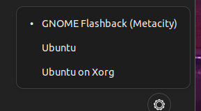
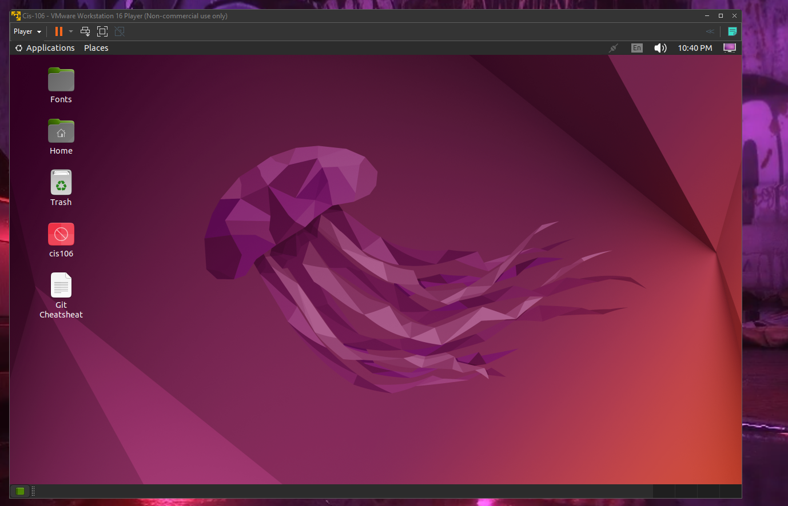

# Lab 3 Submission

## Question 1

Files in folder

## Question 2

## Question 3

| Program purpose     | Package Name | Version |
| ------------------- | ------------ | ------- |
| Play a tetris game  |      vitris  | 0.59.1-2 |
| Play a video file   |    xjadeo          |   0.8.10-1|
| Browse the internet | epiphany-browser  | 42.4-0ubuntu1|
| Read your email     |   yaws-mail  |  2.1.1+dfsg-1|
| Play music          |deepin-music  |.0.1.54+ds.1-2build1|

## Question 4

| command | what it does |
| ------- | ------------ |
| echo    | Prints I Like linux |
| fortune | random quote |
| cowsay  |  prints statement in text bubble with cow art  |
| lolcat  |  Makes text a colored gradient   |
| figlet  |  Makes big outline ascii art letters   |
| toilet  |  Makes big filled ascii art letters b |
| rig     |   generates an identity   |