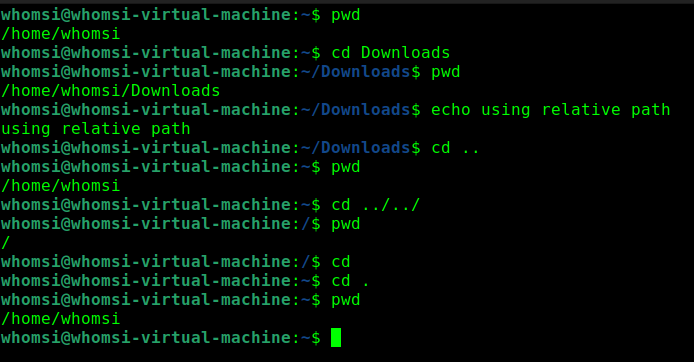
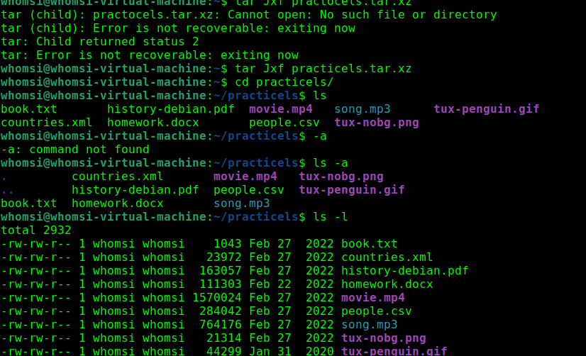
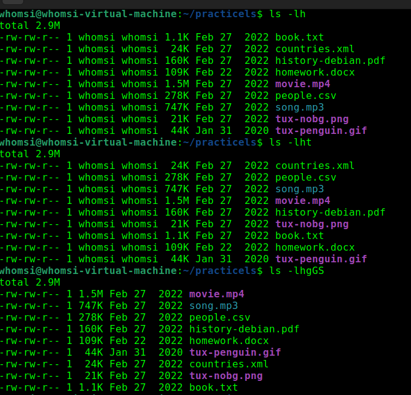
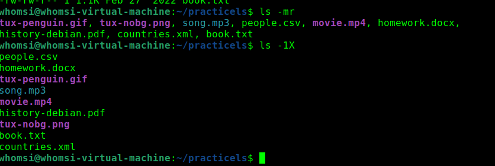
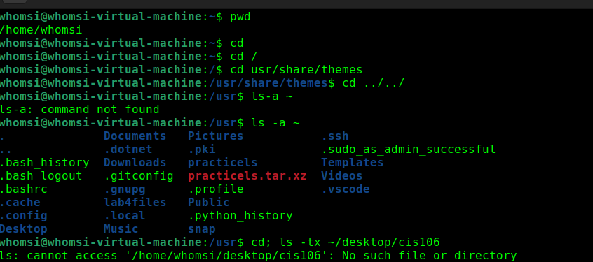
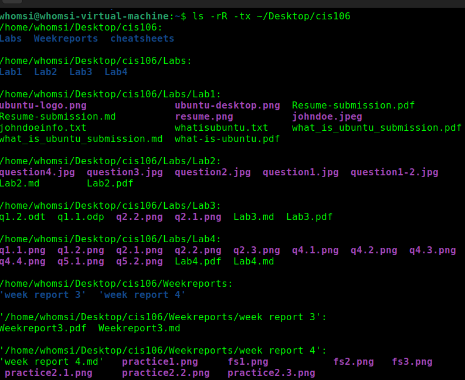
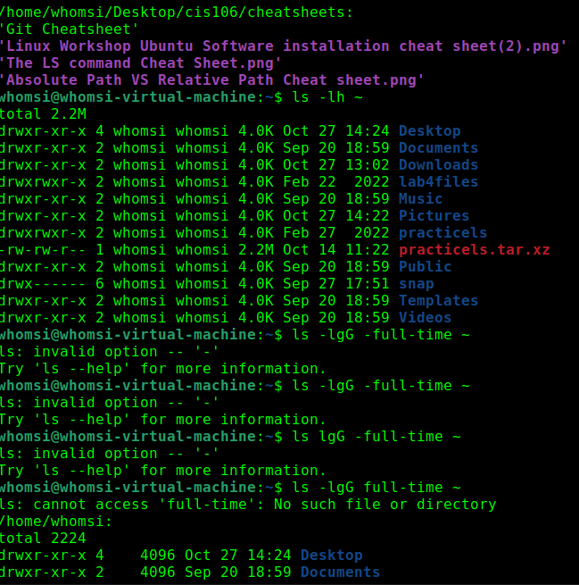
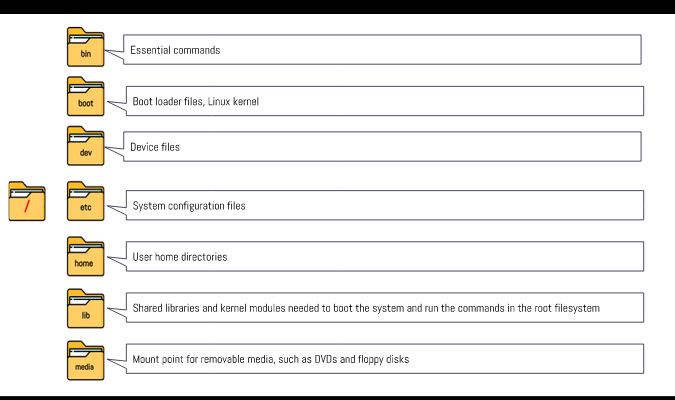
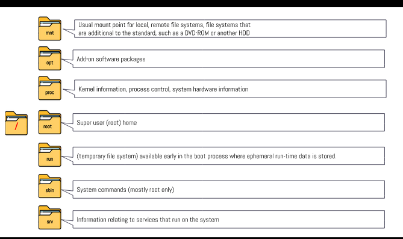
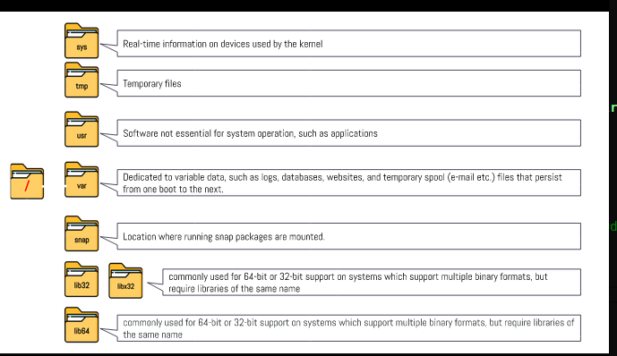

***
Name: Wael Homsi
Course: CIS-106
Semester: Fall 23
---

# Week Report 4

## Practice from the presentations The Linux File system:
 #### Practice 1

#### Practice 2

#### Practice 3

## The Linux File system directories and their purpose:

## All the commands for navigating the filesystem:
| Command | Function | Syntax | Example |
|---------|----------|--------|---------|
| pwd  | prints current directory | pwd | `pwd` |
| cd | changes directory| cd file/path | `cd home/james/Downloads`
| ls | lists files in directory | ls -option file/path| `ls -l home/james/downloads`

## Basic terminology

* **File system -** The way Files are organized
  
* **Current directory -** The directory you are in
  
* **parent directory -** The previous directory to your current one
  
* **the difference between YOUR HOME directory and THE HOME directory -** The users directory is the "your directory" and "the home" directory is the devices directory not in reference to the user
  
* **pathname -**  A way to tell your computer where a file or folder is.
  
* **relative path -** Describes where a file is in relation to where you currently are.
  
* **absolute path -** Tells exactly where a file is starting from the main or root folder.