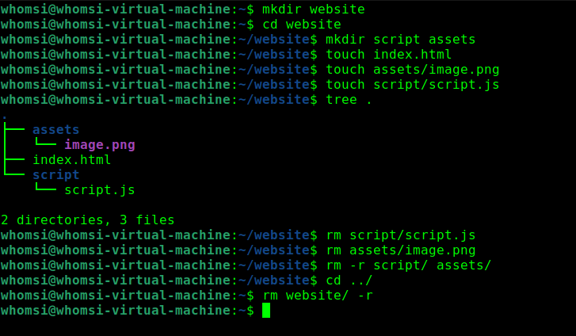
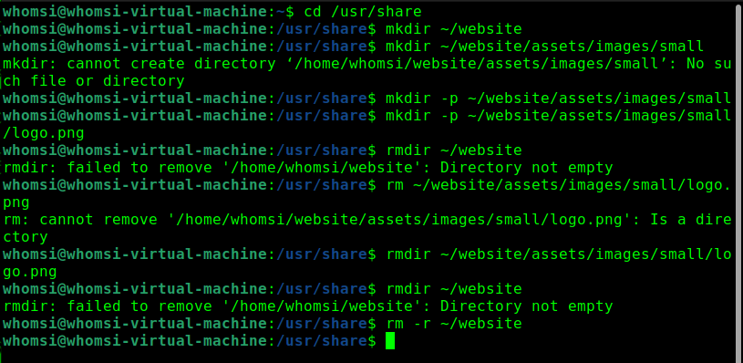
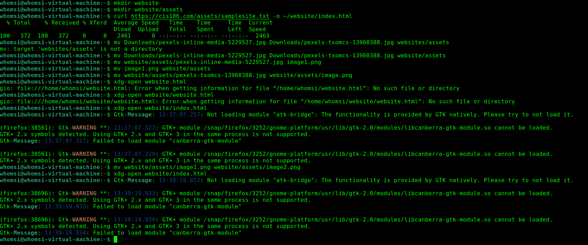
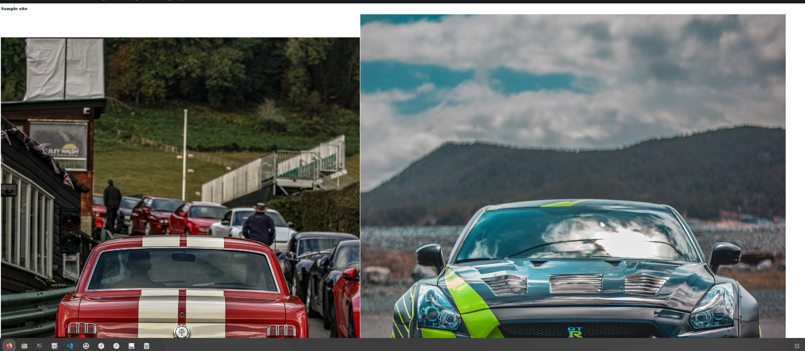
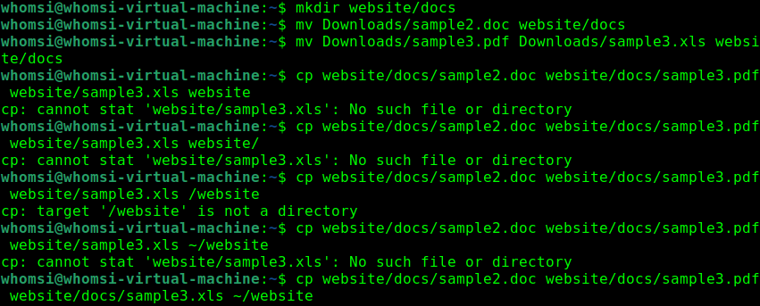
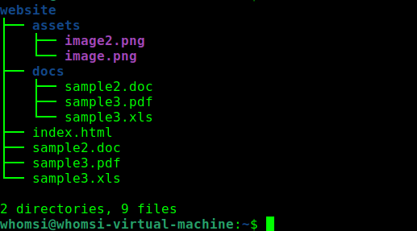

***
Name: Wael Homsi
Course: CIS-106
Semester: Fall 23
---

# Week Report 5

## What are Command Options?

> Command options are modifiers that alters what the command would normally print for the desired outcome. ex: ls -x1 the -x1 is the option

## What are Command Arguments?

> Command arguments are the inputs for the command; ex: cp file.txt/otherfile the file.txt would be the argument

## Which command is used for creating directories? Provide at least 3 examples.

> Mikdir is the command used for creating directories ex: mkdir Downloads/games | mkdir Pictures/cars | mkdir Documents/homework.txt

## What does the touch command do? Provide at least 3 examples.

>The touch command is similar to mkdir but instead of a folder it makes a file. ex: touch Pictures/bob.png | touch Documents/taxes.txt | touch Music/reggae.mp3 

## How do you remove a file? Provide an example.

> To remove a file use the rm command. ex: rm file.pdf

## How do you remove a directory and can you remove non-empty directories in Linux? Provide an example

> To remove a directory you must use rmdir or rm -r commands or you will get an error. ex rmdir mydirectory

## Explain the mv and cp command. Provide at least 2 examples of each

> The mv command is used to move or rename files and directories. ex: mv files.txt files1.txt | mv dir1/assets /dir2

> The cp command is used to copy files and directories. ex: cp file.txt file1.txt | cp -r dir1 dir2

## Practice 1

## Practice 2

## Practice 3

## Practice 4

