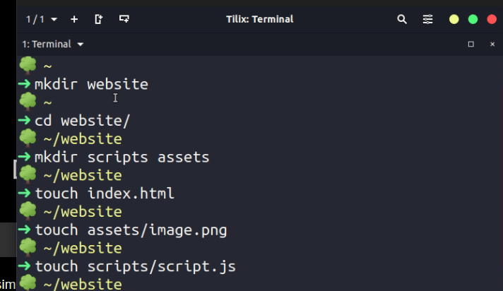
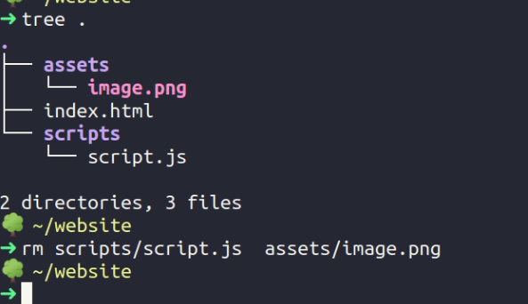
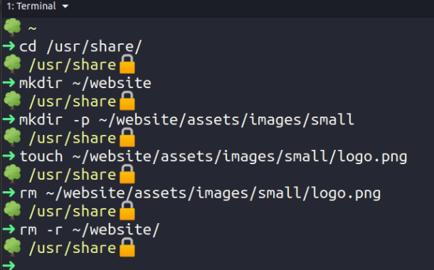
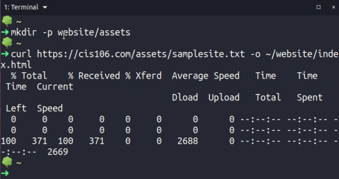
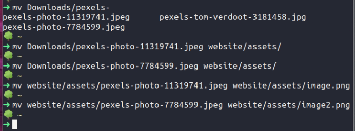
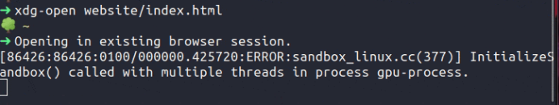

***
Name: Wael Homsi
Course: CIS-106
Semester: Fall 23
---

# Week Report 6

## * Wildcard:
### Example: file*.txt (Matches: file1.txt, file2.txt, file123.txt, etc.)
### Example: *.jpg (Matches: image.jpg, photo.jpg, background.jpg, etc.)
### Example: *data* (Matches: userdata.txt, datafile.csv, bigdata_analysis.xlsx, etc.)

## ? Wildcard:
### Example: image?.png (Matches: image1.png, imageA.png, but not image12.png or imageXY.png)
### Example: file?.txt (Matches: file1.txt, fileA.txt, but not file12.txt or fileXYZ.txt)
### Example: doc-?.docx (Matches: doc-1.docx, doc-A.docx, but not doc-12.docx or doc-XYZ.docx)

## [] Wildcard:
### Example: file[123].txt (Matches: file1.txt, file2.txt, file3.txt, but not file4.txt or fileA.txt)
### Example: data[0-9].csv (Matches: data1.csv, data2.csv, ..., data9.csv, but not data10.csv or dataA.csv)
### Example: image[AB].png (Matches: imageA.png, imageB.png, but not imageC.png or image123.png)

## Brace expansion 
# Brace expansion is a feature available in some command shells (like Bash) that allows you to generate arbitrary strings by specifying a range or a list of values enclosed in curly braces {}. Here are three examples of how to use brace expansion:

### Example 1 - Range:

#### Command: echo file{1..3}.txt
#### Result: Outputs file1.txt file2.txt file3.txt
### Example 2 - List:

#### Command: echo {apple,orange,banana}_pie
#### Result: Outputs apple_pie orange_pie banana_pie
### Example 3 - Combination:

#### Command: mkdir {2019..2021}/{Jan,Feb,Mar}-reports
#### Result: Creates directories for yearly reports from 2019 to 2021, each containing monthly reports for January, February, and March.

## Practice 

### Practice 1 

 

## Practice 2

## Practice 3

